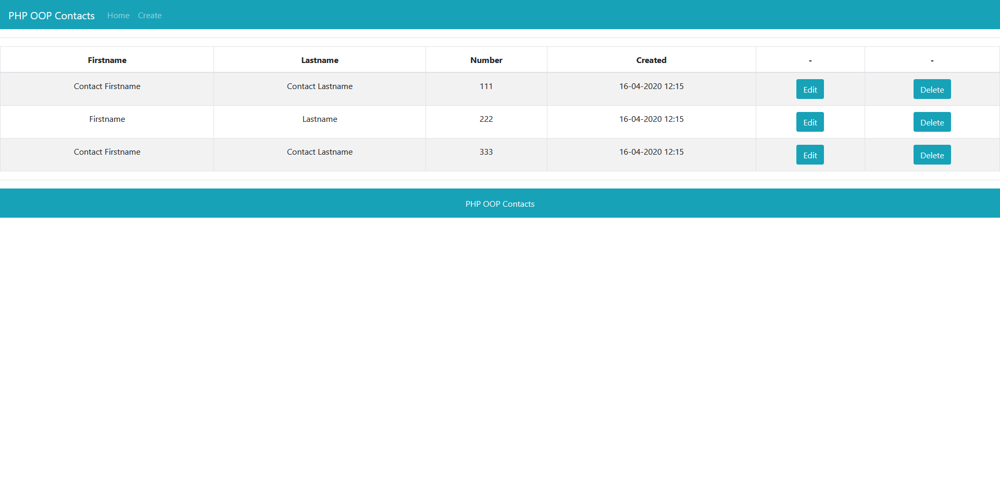
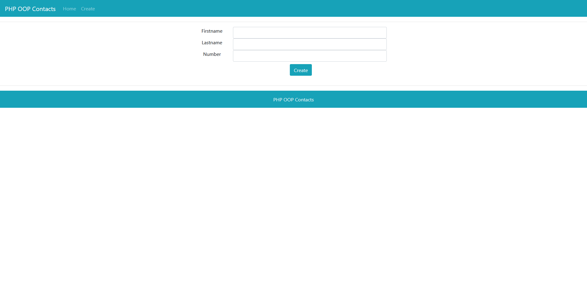
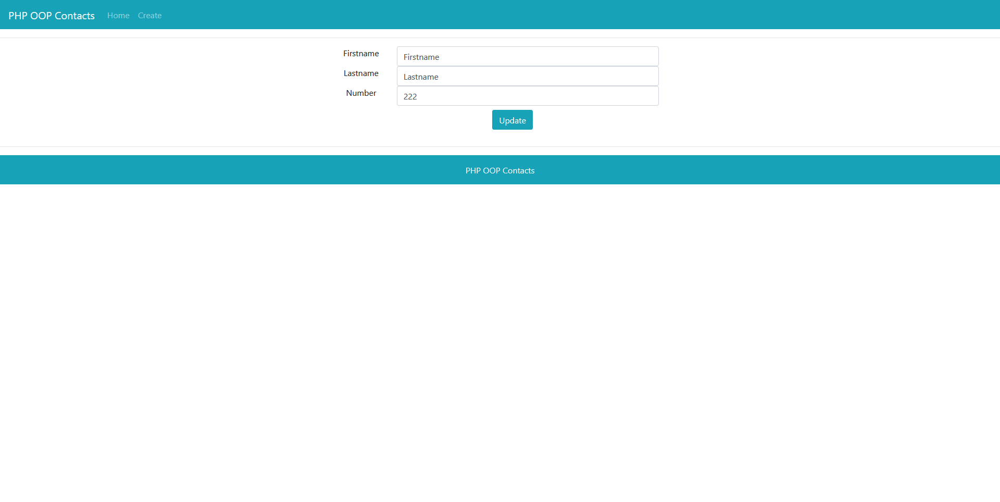
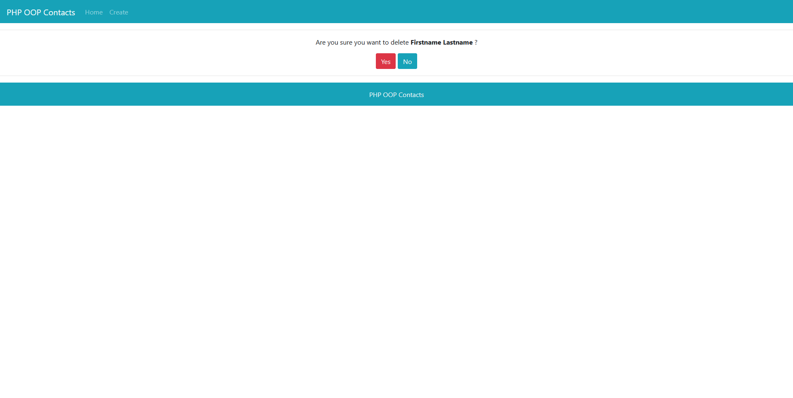
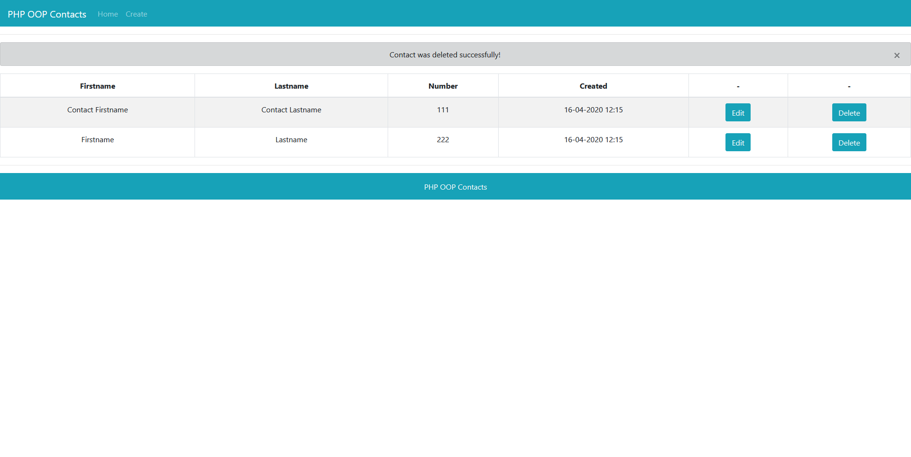

# PHP OOP Contacts

A simple PHP OOP Contacts application with basic CRUD.

## Installation

01. Clone the repository
```
git clone https://github.com/danielgogov-github/PHP_OOP_Contacts.git
```

02. Run database.sql to create the database and the table

03. Copy config.ini
```
cp config.ini.example config.ini
```

04. Set database username and database password
```
db_username = "username"
db_password = "password"
```

05. Run the application with web server
```
http://localhost/PHP_OOP_Contacts/
```

## Features

01. Show all contacts
02. Create a new contact
03. Edit a contact
04. Delete a contact

## Screenshots 

`View all contacts`


`Create a new contact`


`Edit a contact`


`Delete a contact`


`Show status messages`

